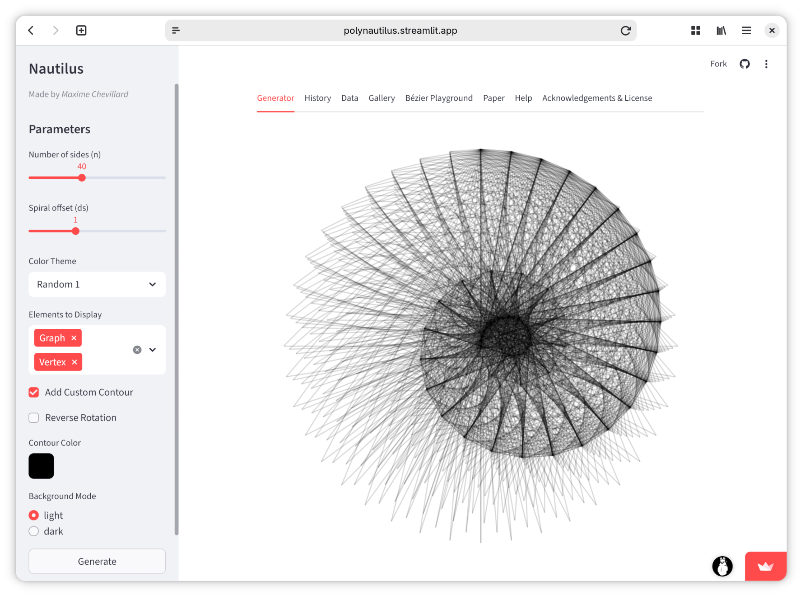
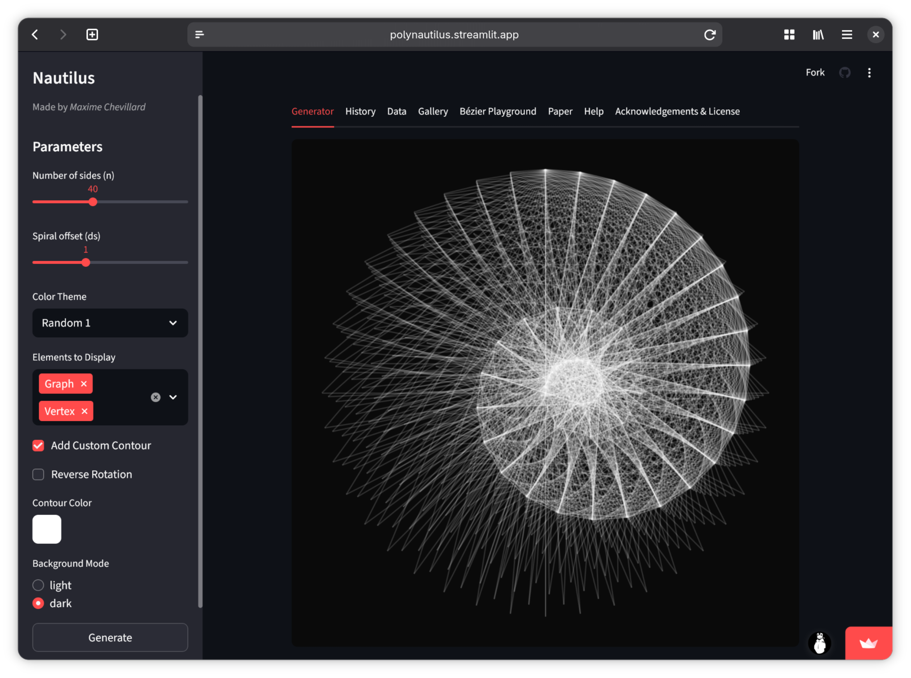
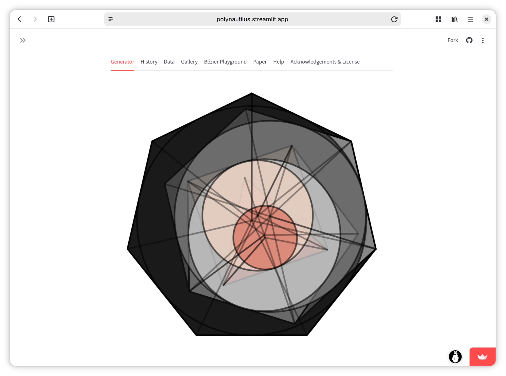
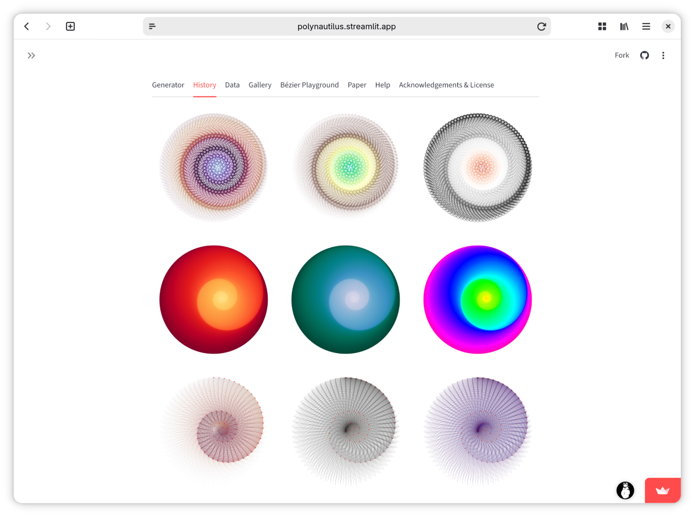
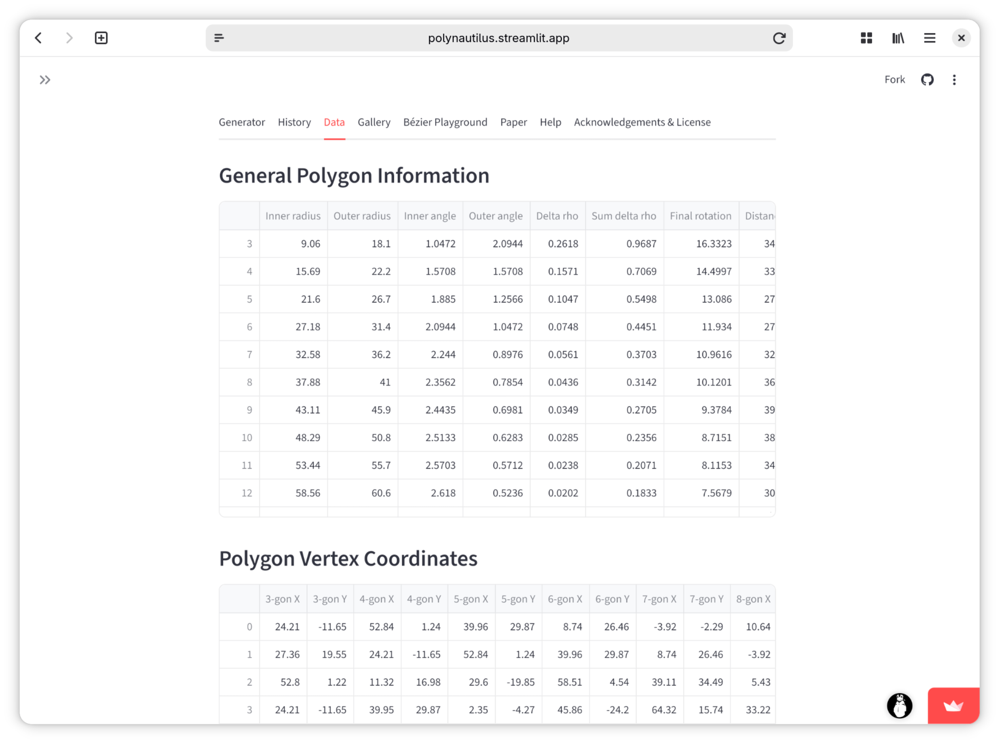
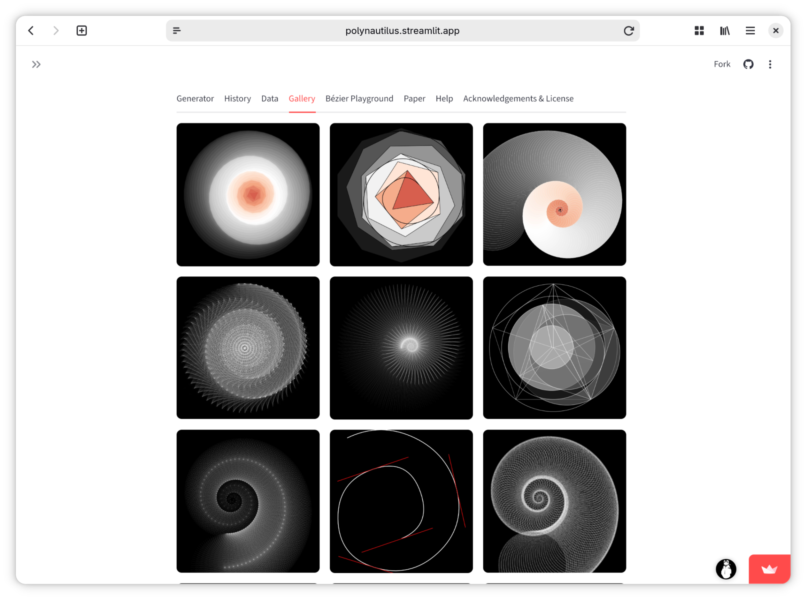
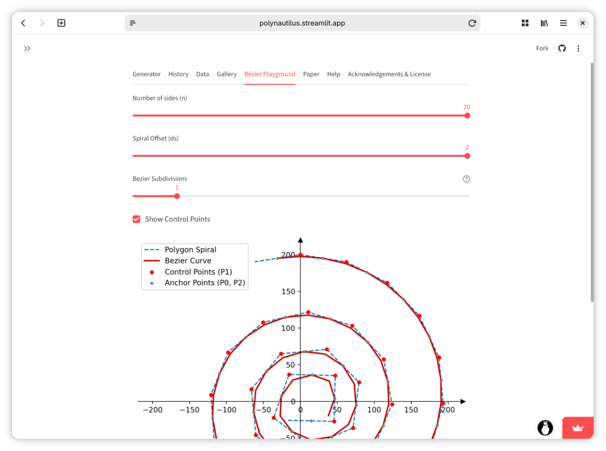
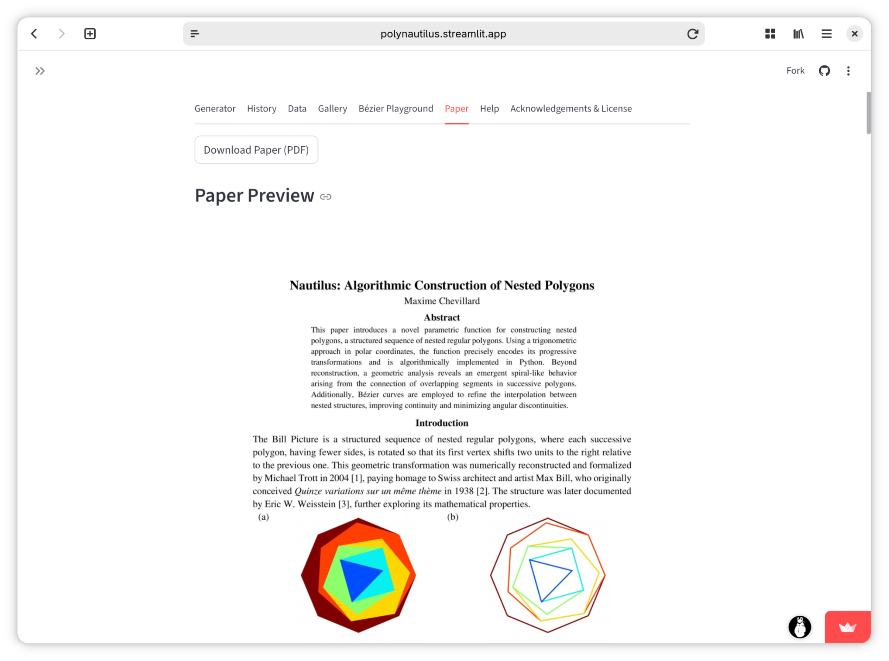
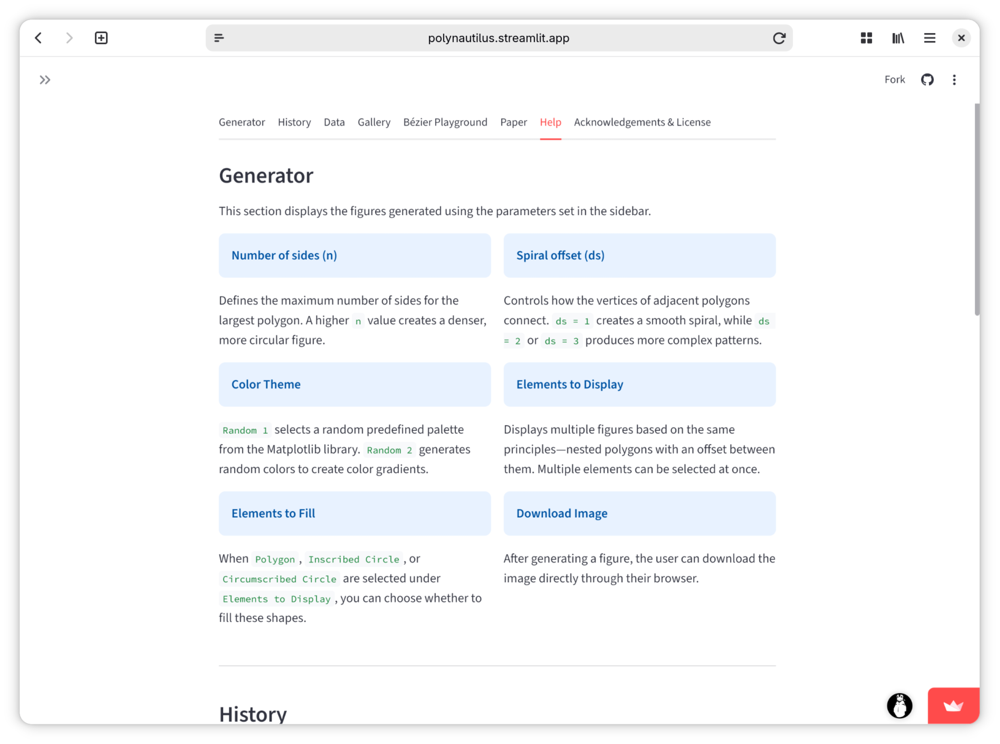
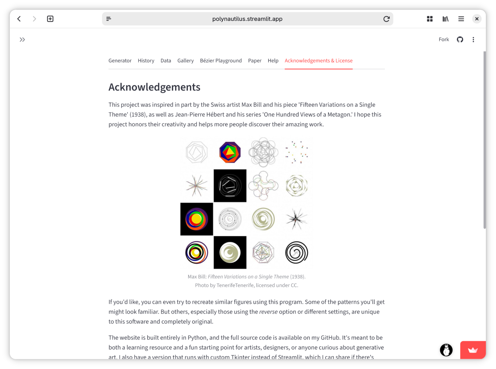

# Nautilus – Generative Polygon Art

Nautilus is an interactive Streamlit app for exploring nested polygons, spirals, and Bézier curves. Adjust a few controls and the app produces colorful geometric art while exposing the underlying math.

<table>
  <tr>
    <td></td>
    <td></td>
  </tr>
</table>

## Highlights
- Interactive generator with controls for polygon count, spiral offset, fill/outline visibility, and dark/light mode
- Multiple color themes plus two random palettes for happy accidents
- Optional overlays: polygon spiral, inscribed/circumscribed circles, Bézier curve, vertices, and more
- History that keeps your last 21 renders in-session for quick comparison
- Data tab with the exact coordinates and derived values powering each render
- Gallery of curated examples and a built-in viewer for the accompanying paper

## Quickstart
1. Install Python 3.8+ and clone this repo.
2. (Recommended) create a virtual environment:
   ```bash
   python3 -m venv .venv
   source .venv/bin/activate  # Windows: .\.venv\Scripts\activate
   ```
3. Install dependencies:
   ```bash
   pip install -r requirements.txt
   ```
4. Launch the app:
   ```bash
   streamlit run streamlit_app.py
   ```
   Streamlit will open a browser tab automatically.

## Using the App
- **Generator tab**: Pick the number of polygon sides, spiral offset, color theme, and what to display/fill. Toggle reverse rotation, dark mode, and line thickness behavior.
- **History tab**: View and restore the last 21 generated figures from this session.
- **Data tab**: Inspect the coordinate tables and derived values produced by `Calculation`.
- **Bézier Playground**: Focus on the Bézier curve generated from the polygon spiral’s control points.
- **Gallery tab**: Browse example renders from `images/gallery/`.
- **Paper tab**: Read the included PDF (`paper/paper.pdf`) without leaving the app.

## Project Structure
- `streamlit_app.py` – Streamlit UI, plotting logic, and tab layout
- `calculation.py` – Math core for polygon geometry, spirals, and Bézier control points
- `images/gallery/` – Sample renders displayed in the Gallery tab
- `images/icon/icon.png` – App icon
- `paper/paper.pdf` (+ `paper/paper-*.jpg`) – Paper shown in the Paper tab
- `.streamlit/config.toml` – Streamlit theme defaults

## Screenshots

<table>
 <tr>
  <td></td>
  <td></td>
 </tr>
 <tr>
  <td></td>
  <td></td>
 </tr>
 <tr>
  <td></td>
  <td></td>
 </tr>
 <tr>
  <td></td>
  <td></td>
 </tr>
</table>

## License
Distributed under the MIT License. See `LICENSE` for details.
